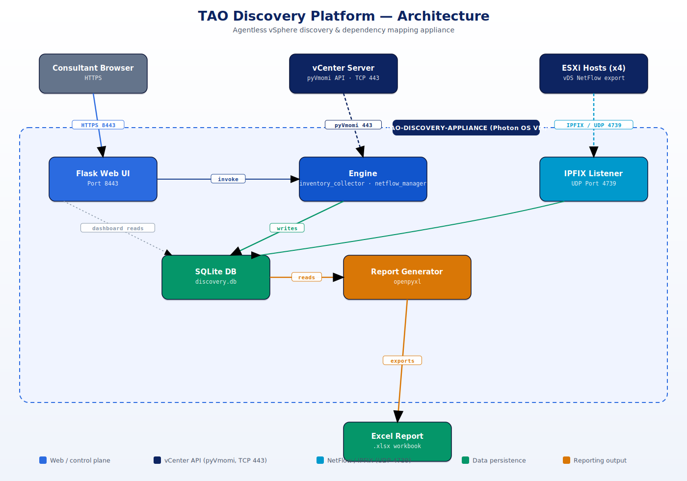

# TAO Discovery Appliance

Agentless VMware vSphere discovery and application-dependency mapping appliance, built for TAO Digital Solutions migration engagements. It inventories a client's vSphere environment (datacenters, clusters, hosts, VMs, datastores) via the vCenter API, optionally maps VM-to-VM network dependencies via vDS NetFlow/IPFIX, and produces branded Excel reports.

**Long-term goal:** this is the foundation for a broader wave-planning tool for VM migration projects — see [Roadmap](#roadmap) below.



## Progress tracker

Legend: ✅ Done &nbsp;·&nbsp; 🟡 In progress &nbsp;·&nbsp; ⬜ Not started &nbsp;·&nbsp; 🔒 Security follow-up

**Deployed & verified** — lab instance at `m1-vc.taodigital.lab`, resource pool `TAOAssess360`

| | Item | Detail |
|:---:|---|---|
| ✅ | Repo reorganized | `web/` `engine/` `collector/` layout, broken imports fixed, missing modules added |
| ✅ | Appliance VM | `TAO-Discovery-Appliance`, Photon OS 5.0, powered on |
| ✅ | Web UI | Flask on port 8443, `systemd`-managed, reachable and verified |
| ✅ | SQLite schema | Initialized via `db_init.py` (currently empty — no scan run yet) |
| ✅ | IPFIX listener | Running on UDP 4739, idle (no flows fed yet) |
| ✅ | Icon/encoding bug | Fixed literal `\uXXXX` text rendering in 4 templates |

**Next up**

| | Item | Priority |
|:---:|---|---|
| ⬜ | Add an isolated test vDS to `ALLOWED_VDS` and validate NetFlow config | High |
| ⬜ | Run the first live discovery scan against the lab vCenter | High |
| ⬜ | Generate VM-to-VM traffic and confirm IPFIX flows land in `dependencies` | High |
| 🔒 | Move off root/password SSH → key-based auth or dedicated service account | Medium |
| 🔒 | Scope the vCenter service account down to read-only least-privilege | Medium |
| ⬜ | Wave-planning feature (grouping VMs into migration waves) — **net-new, no code yet** | Future |
| ⬜ | UI/UX polish pass extending the existing design system to new pages | Future |
| ⬜ | Turn the deployment guide into a repeatable installer (cloud-init/kickstart) | Future |

Nothing beyond the one appliance VM has been touched in the lab vCenter — no vDS/NetFlow changes, no other VMs or resource pools affected.

## Architecture

```
web/app.py                       Flask app — routes, API endpoints, discovery orchestration
web/templates/*.html             UI pages (Configuration, Dashboard, Dependencies, Status, Report Center)
engine/vcenter_connect.py        Shared SSL-aware vCenter connection helper
engine/inventory_collector.py    pyVmomi-based inventory collection (DCs, clusters, hosts, VMs, datastores)
engine/netflow_manager.py        vDS NetFlow/IPFIX config, gated by ALLOWED_VDS safelist (empty by default)
engine/db_init.py                SQLite schema creation (idempotent)
engine/report_generator.py       Branded multi-sheet Excel export
collector/ipfix_listener.py      UDP 4739 listener, decodes IPFIX flow records into the dependencies table
```

Data flow: `config.html` collects vCenter creds → `/api/preflight` lists vDS switches (read-only) → `/api/start_discovery` runs `inventory_collector` + (if `ALLOWED_VDS` is populated) `netflow_manager` → results land in SQLite → `dashboard.html`/`dependencies.html` visualize it → `/api/generate_reports` exports Excel.

Full field-by-field deployment steps (Photon OS install, systemd units, port reference, service-account privileges) are in `TAO_Discovery_Deployment_Guide.docx`.

## Working together

- **Branching:** create a feature branch per change (`git checkout -b <name>`), open a PR into `main` rather than pushing directly, so the other person can review.
- **Secrets:** never commit credentials, `.env` files, or `discovery.db`/logs/reports — all covered by `.gitignore`. Pass vCenter credentials through the Configuration page or environment variables at runtime, never hardcode them.
- **Shared lab appliance:** the deployed VM above is a shared resource — coordinate before running a live discovery scan or changing its systemd services, since it'll affect whatever the other person is looking at.
- **Deployment guide vs. reality:** the `.docx` guide was written against Photon OS 4.0; the lab instance ended up on 5.0 due to what was locally available, which surfaced a few version-specific gotchas — see below. Keep the guide as the procedural reference, but expect to hit these on a fresh deploy.

### Gotchas hit during the first deployment (Photon OS 5.0)

- **CD-ROM must be on a SATA controller, not IDE** — Photon 5.x's installer fails with "installation medium is not readable" if the CD/DVD device is attached via IDE.
- **New VM disks need `fileOperation="create"`** in the device spec when scripting VM creation via pyVmomi/govmomi, or the disk device exists in config but has no backing file (fails at power-on with "unable to enumerate all disks").
- **`sshd` is inactive and `PermitRootLogin no` by default** on a fresh Photon minimal install — needs enabling before the guide's `scp`/`ssh` based file-transfer steps work.
- **Photon's default firewall (`iptables`) only allows inbound SSH.** Port 8443 (web UI) needs an explicit `ACCEPT` rule, persisted to `/etc/systemd/scripts/ip4save` (see `iptables-save` output), or it's lost on reboot.
- **A base `tdnf update -y` on an unpatched ISO can be a very large upgrade** (kernel, systemd, openssh, and even the default Python interpreter). Worth doing on a scratch VM first if timing matters, and expect to need `systemctl restart sshd` if the SSH package itself gets replaced mid-upgrade.

## Roadmap

| Status | Phase |
|:---:|---|
| ✅ | **Phase 1 — Appliance foundation** |
| 🟡 | **Phase 2 — Validate discovery + dependency mapping** |
| ⬜ | **Phase 3 — Security hardening** |
| ⬜ | **Phase 4 — Wave planning** *(the actual product goal)* |
| ⬜ | **Phase 5 — UI/UX polish pass** |
| ⬜ | **Phase 6 — Packaging for repeat engagements** |

**✅ Phase 1 — Appliance foundation**
Base appliance deployed and reachable; inventory collector, report generator, and UI shell all in place and bug-fixed.

**🟡 Phase 2 — Validate discovery + dependency mapping** *(in progress)*
- Add a dedicated/isolated vDS to `ALLOWED_VDS` in `engine/netflow_manager.py`
- Run a live discovery scan against the lab vCenter, confirm inventory populates correctly
- Generate VM-to-VM traffic and confirm the IPFIX listener actually captures and attributes flows

**⬜ Phase 3 — Security hardening**
- Move off root/password SSH to key-based auth (or a dedicated non-root service account)
- Read-only vCenter service account with the minimal privilege set (documented in the deployment guide's appendix)
- Review whether the web UI needs auth in front of it before it's used against real client environments

**⬜ Phase 4 — Wave planning** *(the actual product goal)*
- Group discovered VMs into migration waves using the dependency graph as a constraint (don't split tightly-coupled VMs across waves)
- Wave sequencing UI, capacity/readiness indicators per wave
- This is net-new work on top of the current inventory/dependency foundation — no code exists for this yet

**⬜ Phase 5 — UI/UX polish pass**
The existing dashboard/config/status pages already have a consistent premium design system (see the CSS custom properties at the top of each template) — extend that system to the wave-planning UI rather than introducing a new visual language.

**⬜ Phase 6 — Packaging for repeat engagements**
Turn the deployment guide into something closer to a one-command installer (cloud-init / kickstart) so deploying at a new client doesn't require the manual phase-by-phase process every time.

## Reference

- Deployment guide: `TAO_Discovery_Deployment_Guide.docx`
- Required vCenter service-account privileges: see the guide's appendix
- Port reference (appliance ⇄ vCenter/ESXi/consultant laptop): see the guide's appendix
